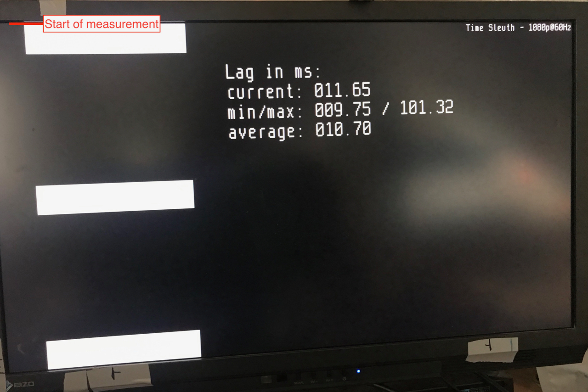
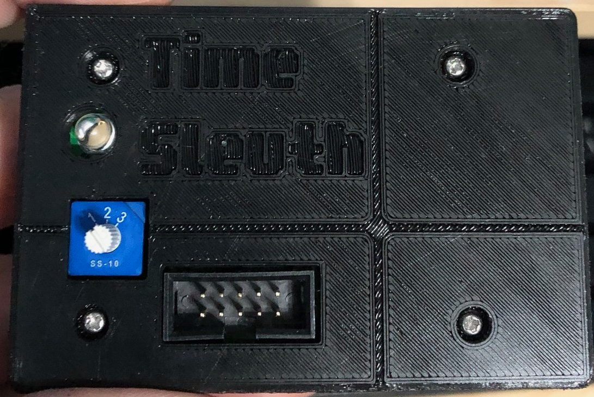
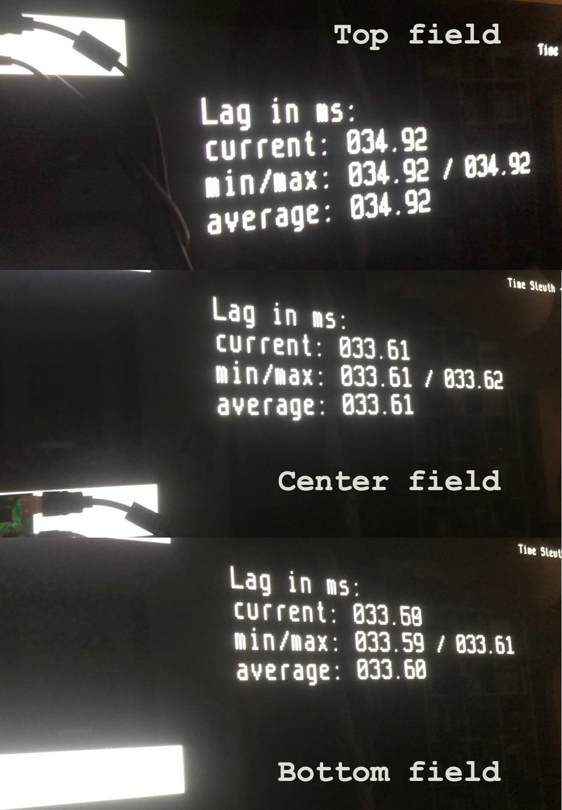

# Time Sleuth - Open Source Lag Tester

## Hardware

Hardware by [**citrus3000psi**](https://twitter.com/citrus3000psi)

Kicad project can be found here: [github.com/citrus3000psi/Time-Sleuth](https://github.com/citrus3000psi/Time-Sleuth).

## Firmware

- Latest Firmware: [time-sleuth-firmware.zip](https://gitlab.com/chriz2600/lagtester/-/jobs/artifacts/master/download?job=fpga-firmware)
- Custom firmware: [time-sleuth.i74.de](https://time-sleuth.i74.de)

Automatic builds are done with [gitlab-ci](https://gitlab.com/chriz2600/time-sleuth/pipelines).

To program the firmware, a USB Blaster programmer is needed, e.g. from [ebay](https://www.ebay.com/i/272455039767?chn=ps)

Software to program the FPGA:

- [Linux 64 Bit](http://download.altera.com/akdlm/software/acdsinst/18.1std/625/ib_installers/QuartusProgrammerSetup-18.1.0.625-linux.run)

- [Windows 64 Bit](http://download.altera.com/akdlm/software/acdsinst/18.1std/625/ib_installers/QuartusProgrammerSetup-18.1.0.625-windows.exe)

- [Windows 32 Bit](http://download.altera.com/akdlm/software/acdsinst/18.1std/625/ib_installers/QuartusProgrammerSetup-18.1.0.625-windows32.exe)

## Operation

Time Sleuth generates a flicker pattern and then measures the time it takes from the start of the first pattern to the moment it shows up on screen using a photo transistor.

The counter measuring the lag starts at the first line of the first field. So if you're using a display, which generates the image from top to bottom (line by line, as LCD/OLED/CRT monitors/TVs will do), the first field will give you the processing lag of the screen, while the second and third field will also include the lag inherent to the line by line drawing of the image.

There are 4 values displayed on the screen:

- `current` (`cur`)

  Shows the value of the last measurement.

- `min/max` (`m/m`)

  Minimum and maximum value within the last averaging period. These values are reset, when a new averaging period starts.

- `average` (`avg`)

  Average value of the last **16** measurements. Most LED backlit LCD screens are using pulse width modulation for brightness adjustment and the PWM duty cycle of the backlight is often not 100% even if brightness is. So the current readings are often jumping, so `average` gives you the mean lag.

  To avoid the flicker pattern to be "in sync" with the PWM frequency, the time between two fields is cyclically changed by one frame up to 8 frames.

- ***LED***

  Flashes, when a measurement was performed.

- ***Switch***

  Factory firmware switches between:
  
  - 1080p (`1`)
  - 1080i (`2`) 
  - 720p (`3`)
  - 480p (`4`)
  - 480i (`5`)

  Custom firmware can be built here: [time-sleuth.i74.de](https://time-sleuth.i74.de)

  The following resolutions are available:

  - 1080p
  - 1080i
  - 960p
  - 720p
  - 480p
  - 480i
  - 240p
  - VGA
  - 576p
  - 576i
  - 288p

- ***10pin JTAG connection***

  JTAG interface for updateing the firmware using an USB Blaster.

- ***Crosshair***

  The crosshair indicates the position of the photo transistor on the bottom of the device and helps aligning over the measurement fields.

## Notes

- While the time to display a frame in 60Hz is **16.6 ms** the display time for 1080p from the first visible line to the last visible line is only **16 ms** and **14.6 ms** from the middle of the first field to the middle of the last field.

- Plasma displays are not displaying the image line by line, so you will see nearly the same amount of lag on all fields.

   
  *Time Sleuth on a Panasonic 42VT30 Plasma*
